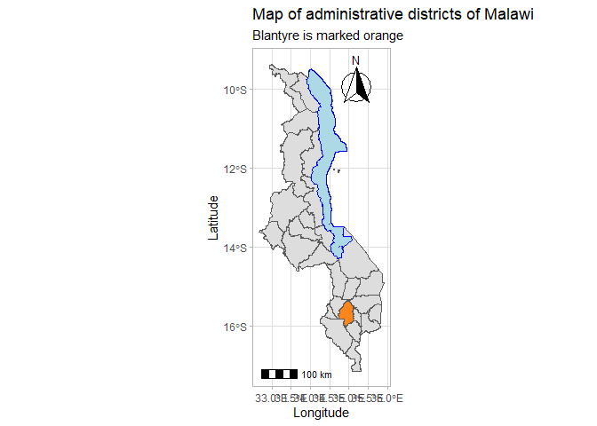

<!-- README.md is generated from README.Rmd. Please edit that file -->

# malawiShapefiles

<!-- badges: start -->
<!-- badges: end -->

The goal of malawiShapefiles is to be the repository of Malawi
administrative and water body shapefiles

## Installation

You can install the released version of malawiShapefiles from
[CRAN](https://CRAN.R-project.org) with:

``` r
#install.packages("malawiShapefiles")
```

And the development version from [GitHub](https://github.com/) with:

``` r
# install.packages("devtools")
devtools::install_github("mcewenkhundi/malawiShapefiles")
```

## 1. Example

This is a basic example which shows you how to solve a common problem:
How to highlight a district in Malawi?

``` r
library(malawiShapefiles)
library(sf)
#> Warning: package 'sf' was built under R version 4.1.2
#> Linking to GEOS 3.9.1, GDAL 3.2.1, PROJ 7.2.1; sf_use_s2() is TRUE
library(tidyverse)
#> -- Attaching packages --------------------------------------- tidyverse 1.3.1 --
#> v ggplot2 3.3.5     v purrr   0.3.4
#> v tibble  3.1.6     v dplyr   1.0.8
#> v tidyr   1.2.0     v stringr 1.4.0
#> v readr   1.4.0     v forcats 0.5.1
#> Warning: package 'tibble' was built under R version 4.1.2
#> Warning: package 'tidyr' was built under R version 4.1.2
#> Warning: package 'dplyr' was built under R version 4.1.2
#> -- Conflicts ------------------------------------------ tidyverse_conflicts() --
#> x dplyr::filter() masks stats::filter()
#> x dplyr::lag()    masks stats::lag()
library(ggspatial)


ggplot() +
  geom_sf(data=malawi, aes(fill = bt_label)) +
  scale_fill_manual(values = alpha(c("#DDDDDD", "#FF851B")),guide=FALSE) +
  labs(y = "Latitude", 
       x = "Longitude",
       title = "Map of administrative districts of Malawi",
       subtitle = "Blantyre is marked orange") +
  geom_sf(data=malawi_lakes[malawi_lakes$NAME=="LAKE NYASA",], fill = "light blue", color = "blue") +
  theme_light() +
  annotation_scale(location = "bl", width_hint = 0.5) +
  annotation_north_arrow(location = "tr", style = north_arrow_fancy_orienteering)
#> old-style crs object detected; please recreate object with a recent sf::st_crs()
#> old-style crs object detected; please recreate object with a recent sf::st_crs()
#> old-style crs object detected; please recreate object with a recent sf::st_crs()
#> old-style crs object detected; please recreate object with a recent sf::st_crs()
#> Warning: It is deprecated to specify `guide = FALSE` to remove a guide. Please use
#> `guide = "none"` instead.
```

 \## 2.
Example

This is a basic example which shows you how to solve a common problem:
How to display a continuous attribute of each district, i.e population ?
